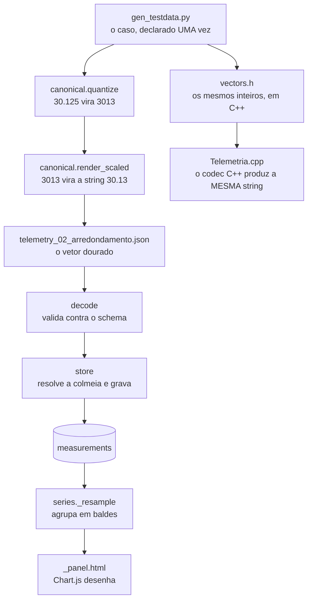

# 02. Uma mensagem ponta a ponta

**Área:** todas · **Tempo:** ~45 min · **Treino**

## Por que este exercício existe

Você já leu o desenho do caminho do dado em [O sistema](../guia/01-o-sistema.md). Este
exercício percorre esse caminho **com um dado concreto**, abrindo cada arquivo onde ele é
transformado. No fim você vai conseguir responder "onde eu mexo?" localizando o ponto certo
no caminho, em vez de procurar por nome de arquivo.

Nada é modificado aqui. É leitura — mas leitura com o repositório aberto do lado.

## Antes de começar

Leia [O contrato](../guia/02-o-contrato.md). Tenha o exercício
[01](01-tudo-verde.md) feito: o banco populado ajuda nos últimos passos.

## O caminho



## Passos

### 1. O vetor dourado

```bash
cat contracts/testdata/telemetry_02_arredondamento.json
```

```json
{"schema":"meliponet.telemetry.v1","node_id":"A4C1380F","seq":10433,"ts":"2027-03-14T12:10:00Z","temp_in_c":30.13,"temp_out_c":0.00,"rh_in_pct":100.00,"rh_out_pct":0.00,"weight_kg":12.500,"vbat_v":4.00,"rssi":-58}
```

Agora abra a **fonte** desse arquivo, em `contracts/tools/gen_testdata.py`, e ache o caso
`"02_arredondamento"` no dicionário `VALID`. Compare os dois lado a lado.

> **Pergunta 1.** O caso declara `temp_in_c: 30.125`, e o arquivo tem `30.13`. Onde, em
> que função, esses dois números se ligam?
>
> **Pergunta 2.** O caso declara `temp_out_c: -0.004`. O arquivo tem `0.00`, e não
> `-0.00`. Onde isso é decidido, e por que importa?
>
> **Pergunta 3.** O caso declara `weight_kg: 12.5` e o arquivo tem `12.500`. Por que o
> contrato exige as três casas mesmo quando elas são zero?

<details>
<summary>Respostas 1 a 3</summary>

**1.** Em `contracts/canonical.py`, duas funções em sequência:
`quantize("temp_in_c", 30.125)` → `3013` (multiplica por `10**2` em `double` e arredonda o
produto, empate para longe do zero), e depois `render_scaled("temp_in_c", 3013)` →
`"30.13"` (pura aritmética de inteiros e strings: insere a vírgula). Confira você mesmo:

```bash
platform/.venv/bin/python -c "
import sys; sys.path.insert(0,'contracts')
from canonical import quantize, render_scaled
q = quantize('temp_in_c', 30.125); print(q, render_scaled('temp_in_c', q))"
```

**2.** Em `render_scaled`, nestas duas linhas:

```python
if sign and int(digits) == 0:
    sign = ""  # nao emite zero negativo
```

Importa porque `-0.004` arredondado dá zero, e `-0.00` é uma string diferente de `0.00`.
Como o teste dos vetores dourados compara **byte a byte**, um lado emitindo `-0.00` e o
outro `0.00` quebraria o CI — e, pior, se ninguém comparasse byte a byte, o banco teria
duas grafias para a mesma medição.

**3.** Porque a quantidade de casas **é** o fator de escala. `weight_kg` com 3 casas
significa que o inteiro interno é o peso em gramas: `12.500` diz "12500 g". Emitir `12.5`
esconderia isso, e as duas implementações teriam de concordar sobre quantos zeros omitir —
mais uma oportunidade de divergir sem que ninguém erre de fato.
</details>

### 2. O outro lado: o mesmo caso, em C++

```bash
grep -A 14 '"02_arredondamento"' contracts/testdata/vectors.h
```

Repare que o C++ recebe os **inteiros já escalados** (`.temp_in_c = 3013`) e o JSON
esperado como string literal. O trabalho do codec C++ é só o segundo passo — inserir a
vírgula.

> **Pergunta 4.** Em que arquivo do firmware um `double` de sensor vira o inteiro escalado?
> E qual linha faz o arredondamento?
>
> **Pergunta 5.** Os dois arquivos que você acabou de comparar — o `.json` e o
> `vectors.h` — saem do mesmo gerador. Por que isso é essencial? O que aconteceria se
> alguém mantivesse os dois à mão?

<details>
<summary>Respostas 4 e 5</summary>

**4.** `firmware/lib/MelipoCore/Escala.cpp`, função `escalar()`. A linha é
`return {static_cast<int32_t>(llround(produto)), true};` — `llround` arredonda ao mais
próximo com empate para longe do zero, aplicado **ao produto**, que é exatamente a regra de
`canonical.quantize`. Note que a checagem de estouro acontece *antes* da conversão:
converter um `double` fora da faixa de `int32_t` é comportamento indefinido em C++.

**5.** Porque um contrato precisa ser um **terceiro artefato, externo aos dois lados**. Se
cada lado mantivesse o seu, você escreveria um teste C++ afirmando que o peso sai `12.5` e
sua colega escreveria um teste Python afirmando que ela lê `12.500` — **os dois testes
passariam** e o sistema estaria quebrado. Cada um teria testado contra a própria crença.
Saindo do mesmo gerador, os dois não podem divergir sem que o `--check` do CI acuse.
</details>

### 3. A entrada da plataforma

Abra `platform/meliponet/ingest/telemetry.py` e siga a função `decode()`.

> **Pergunta 6.** `decode()` confere a versão do schema **antes** de validar contra o JSON
> Schema. Por quê?
>
> **Pergunta 7.** O `ts` é parseado explicitamente com `datetime.fromisoformat`, em vez de
> deixar o JSON Schema validar o formato. Por quê?

<details>
<summary>Respostas 6 e 7</summary>

**6.** O próprio código explica: um nó com firmware de outra versão produziria uma cascata
de erros de schema pouco informativos, quando a causa real é só uma. Como o motivo da
rejeição é **persistido** em `ingest_rejects` (compromisso do Edital 17), a qualidade da
mensagem de erro não é cosmética: é o que alguém vai ler meses depois tentando entender
por que aquele nó foi descartado.

**7.** Porque `format: date-time` no JSON Schema é **anotação, não validação** — o
`jsonschema` só o verifica com um `FormatChecker` e uma dependência extra instalada. Sem o
parse explícito, um `ts` sem fuso passaria, e um instante sem fuso comparado com o período
de instalação do nó atribuiria a medição à colmeia errada, em silêncio.
</details>

### 4. Onde a medição pousa

Agora o vetor 03, que tem um sensor ausente:

```bash
cat contracts/testdata/telemetry_03_sht_externo_ausente.json
```

```bash
platform/.venv/bin/python -c "
import sys; sys.path[:0] = ['platform','contracts']
from meliponet.ingest.telemetry import decode
t = decode(open('contracts/testdata/telemetry_03_sht_externo_ausente.json').read())
print('metricas:', t.metrics)
print('flags:', t.flags)
print('diferencial termico:', t.thermal_differential_c)"
```

> **Pergunta 8.** Que colunas de `measurements` ficariam `NULL` para essa mensagem, e o
> que cada `NULL` significa? (Cuidado: nem todas significam a mesma coisa.)
>
> **Pergunta 9.** O diferencial térmico saiu `None`. Poderia ter saído `29.87`, tratando
> o sensor ausente como zero. Por que não?

<details>
<summary>Respostas 8 e 9</summary>

**8.** Ficariam nulas `temp_out_c` e `rh_out_pct` — **o sensor externo não respondeu**, e a
flag `sht_out_fault` diz isso. Ficariam nulas também `snr`, `sound_rms` e `gateway_id` —
mas por outro motivo: **esses campos são da Fase 5** e nenhum nó de hoje os produz. E
`hive_id` ficaria nula se não houvesse vínculo cobrindo aquele instante — um terceiro
motivo. Três significados diferentes para o mesmo `NULL`; é a `quality_flags` que os
distingue, e por isso ela existe.

**9.** Porque zero significaria "estava 0 °C do lado de fora", uma afirmação falsa sobre o
mundo; e um diferencial de 29,87 °C significaria "a colônia está fazendo um esforço
termorregulatório enorme", que dispararia alerta e mandaria alguém ao meliponário à toa.
Ausente significa "não sabemos", que é verdade. É a distinção mais importante do projeto
inteiro, e ela é carregada pelo tipo: `Leitura` no firmware, `float | None` no banco.
</details>

### 5. Do banco ao gráfico

Com o banco do exercício 01 populado:

```bash
sqlite3 meliponet-dev.sqlite3 "SELECT time, temp_in_c, temp_out_c, weight_kg, quality_flags
                               FROM measurements ORDER BY time DESC LIMIT 5;"
```

Abra `platform/meliponet/services/series.py` e leia `_align` e `_resample`.

> **Pergunta 10.** Uma medição com `ts = 2027-03-14T12:15:00Z` cai em que balde, na janela
> de 24 h (passo de 5 min) e na de 30 dias (passo de 2 h)?
>
> **Pergunta 11.** `_resample` percorre **todos** os baldes da janela e devolve `None` nos
> vazios, em vez de simplesmente omiti-los. Qual seria o efeito visual de omitir?

<details>
<summary>Respostas 10 e 11</summary>

**10.** `12:15:00Z` na janela de 5 min; `12:00:00Z` na de 2 h. Os baldes são ancorados na
**época**, não na primeira leitura da consulta — sem isso, cada recarga do painel
deslocaria levemente todos os pontos do gráfico. Confira:

```bash
platform/.venv/bin/python -c "
import sys; sys.path.insert(0,'platform')
from datetime import datetime, UTC, timedelta
from meliponet.services.series import _align
ts = datetime(2027,3,14,12,15, tzinfo=UTC)
for p in (timedelta(minutes=5), timedelta(hours=2)):
    print(p, '->', _align(ts, p).isoformat())"
```

**11.** Os pontos vizinhos se encostariam e **a lacuna desapareceria** do gráfico. Junto
com `spanGaps` desligado no `_panel.html`, é o par que garante que uma mensagem perdida
apareça como buraco. Interpolar por cima seria afirmar uma medição que ninguém fez — e a
completude, que o Edital 17 se compromete a reportar, perderia o sentido se a interface
desenhasse uma linha contínua por cima do que se perdeu.
</details>

## Critério de pronto

- [ ] Você respondeu as 11 perguntas antes de abrir os gabaritos
- [ ] Você rodou pelo menos um dos comandos `python -c` e viu o número aparecer
- [ ] Você consegue dizer, sem consultar, os **dois** arquivos onde `30.125` vira `3013`
      (um em Python, um em C++)

## Pistas

<details>
<summary>Não achei onde `quantize` é chamado</summary>

`canonical_dumps` chama `_encode`, que chama `render_scaled(field, quantize(field, value))`
para os campos numéricos. Comece por `canonical_dumps` e desça.
</details>

<details>
<summary>O `sqlite3` não encontra o banco</summary>

Rode da raiz do repositório, e confira que o arquivo existe: `ls -la *.sqlite3`. Se não
existir, você ainda não fez o passo 2 do exercício 01.
</details>

## O que levar daqui

**Uma métrica passa por exatamente duas transformações antes de virar bytes:** o
arredondamento para inteiro (uma vez, na camada de sensores) e a inserção da vírgula
(pura aritmética inteira). Todo o resto do sistema move o mesmo inteiro.

**`NULL` não tem um significado só.** Sensor com falha, campo de uma fase futura e nó sem
vínculo produzem a mesma coluna vazia por razões diferentes.

→ Próximo: [Onde eu mexo?](03-onde-eu-mexo.md)
