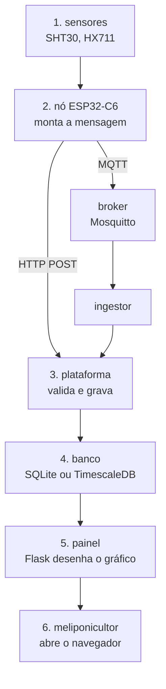

# 1. O sistema

## O que o sistema faz

Uma colmeia de abelha sem ferrão é um sistema homeostático. A colônia mantém a região de
cria numa faixa térmica estreita — perto de 30 °C nas espécies com favos e invólucro de
cerume — e desvios sinalizam estresse, enfraquecimento ou eventos reprodutivos.

O problema é que ninguém consegue observar isso. O manejo tradicional é abrir a caixa
algumas vezes por ano, o que **altera o que se quer medir** (abrir muda o microclima),
**estressa a colônia** e **produz medições pontuais**, que não revelam dinâmica nenhuma.
Entre uma inspeção e outra, o meliponicultor não sabe nada: enxameação, colapso e
infestação só são percebidos quando já são irreversíveis.

O MelipoNet substitui isso por medição contínua e não invasiva: um nó sensor dentro da
caixa mede temperatura interna e externa, umidade e peso, e envia para uma plataforma web
que mostra, guarda e analisa.

## O caminho de um dado

Vale decorar este caminho. Quase toda pergunta sobre "onde eu mexo?" se responde
localizando o ponto certo nele.



Quatro observações sobre esse desenho que não são óbvias:

**O passo 2 é o exercício.** O nó não vem pronto neste repositório: quem o escreve é
você, seguindo [`firmware/ROTEIRO.md`](../../firmware/ROTEIRO.md). Todo o resto já
funciona e serve de corretor — enquanto a mensagem estiver errada, o ponto não aparece
na tela.

**Há duas portas de entrada, e elas terminam no mesmo lugar.** O POST HTTP é o caminho de
aprendizado: nenhuma peça a mais para instalar. O MQTT é o caminho de campo, porque o
broker guarda a mensagem enquanto o servidor reinicia. Depois da porta, o código é o
mesmo.

**O ingestor MQTT é um programa separado do servidor web.** Parecem a mesma coisa (os
dois são Python, os dois falam com o banco), mas rodam como processos independentes. Se
fossem um só, reiniciar o site para publicar uma correção derrubaria a recepção de
telemetria junto — e cada segundo fora do ar viraria uma lacuna permanente nas séries.

**A rede vai cair.** Não "pode cair": vai. O meio rural tem conectividade intermitente, e
o sistema é projetado assumindo isso — o nó guarda as mensagens que não conseguiu enviar
e as reenvia quando a rede volta.

## O mapa do repositório

```
meliponet/
├── contracts/     A MENSAGEM. O formato exato que o nó envia e a plataforma aceita,
│                  com exemplos prontos para copiar e testar.
│
├── firmware/      Só o ROTEIRO.md: o que o nó precisa fazer. O código é seu.
│
├── platform/      A plataforma web, em Python/Flask.
│   ├── meliponet/    o código (rotas, ingestão, modelos, serviços)
│   ├── migrations/   as mudanças de estrutura do banco
│   └── tests/        os testes
│
├── simulator/     Gera dados sintéticos como se fosse um nó real.
│                  É o que permite trabalhar na plataforma sem hardware nenhum.
│
├── deploy/        Como o sistema sobe num servidor. Fora da trilha do aluno.
└── docs/          Este guia, a trilha e os exercícios.
```

## Por que existe um simulador

`simulator/` não é um brinquedo nem um teste. É uma peça de projeto.

O problema que ele resolve: a plataforma precisa de dados para ser desenvolvida, e os
dados vêm do hardware, que está sendo construído em paralelo. Sem simulador, quem
trabalha no software ficaria parado esperando quem trabalha no hardware.

O simulador emite a mesma mensagem que o nó emite, então tudo o que vem depois —
validação, banco, gráficos, alertas — é exercitado pelo caminho real. E ele injeta falhas
de propósito (lacunas, deriva de sensor, valores absurdos), porque a plataforma precisa
ser desenvolvida contra dados imperfeitos: em campo, os dados serão imperfeitos.

Ele também é útil enquanto você escreve o firmware: com `--transporte http`, o simulador
faz exatamente o POST que o seu nó vai fazer. Se o dele funciona e o seu não, a diferença
está no seu nó — e não no servidor.

## O que ainda falta

| O quê | Situação |
|---|---|
| Contrato da mensagem, ingestão, banco, painel com gráfico | pronto |
| Usuários, perfis e vínculo histórico nó↔colmeia | pronto |
| **Firmware do nó** | **é o exercício** |
| Alertas, relatórios, dados do INMET | ainda não começou |
| LoRa, gateway, bioacústica, energia solar, invólucro | ainda não começou |
| Rotinas de qualidade e curadoria das séries | ainda não começou |

→ Próximo: [A mensagem](02-a-mensagem.md)
