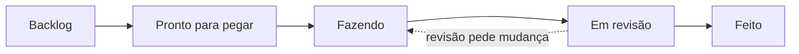

# 5. Como trabalhamos

O que muda quando o código deixa de ser seu e passa a ser da equipe: git, ambiente,
testes, revisão — e como o trabalho é distribuído entre as pessoas do projeto.

## Preparando a máquina

Você precisa de **git** e **Python 3.11+**. Só isso: o firmware do nó é escrito com a
ferramenta que você preferir, fora deste repositório.

```bash
git clone https://github.com/lacouth/meliponet.git
cd meliponet

cd platform
python3 -m venv .venv
.venv/bin/pip install -e ".[dev]"
cd .. && ./verificar          # tudo verde? ambiente ok
```

### Por que não `pip install` direto

Sem ambiente virtual, todos os projetos da sua máquina dividem as mesmas bibliotecas.
Instalar algo para o MelipoNet quebra o trabalho da disciplina de Sinais, e vice-versa. E
na hora de descobrir de que o projeto realmente depende, ninguém sabe. `pyproject.toml`
declara as dependências com versão; o `.venv` é onde elas moram.

## Vendo o sistema rodar

Antes de mexer, veja funcionando. Isso dá o modelo mental que nenhum documento dá.

```bash
cd platform
export DATABASE_URL="sqlite:///$PWD/../meliponet-dev.sqlite3"

.venv/bin/python -m alembic upgrade head          # cria o banco

.venv/bin/python -m flask --app "meliponet:create_app" criar-usuario \
  --email voce@exemplo.br --nome "Seu Nome" --organizacao "Teste" --perfil admin

cd .. && platform/.venv/bin/python -m simulator --transporte direto --historico 48 \
  --organizacao "Teste"                           # 48 h de dados, com falhas injetadas

cd platform && .venv/bin/python -m flask --app "meliponet:create_app" run
```

Abra `http://127.0.0.1:5000` e entre. Vale gastar meia hora explorando: alterne as janelas
de 24 h / 7 dias / 30 dias, procure os **buracos** nos gráficos (são as lacunas que o
simulador injeta de propósito — o gráfico mostra o buraco em vez de ligar os pontos
vizinhos, porque esconder a perda seria mentir sobre a completude), e olhe a tela de
vínculo nó↔colmeia em **Cadastros**.

## Git: o histórico é o produto

Git guarda o histórico do projeto. Não é backup: é a possibilidade de responder "quando
isso mudou, por quê, e o que mais mudou junto".

```bash
git status            # o que mudou desde o último commit
git diff              # exatamente o que mudou, linha a linha
git add -p            # adiciona por pedaço, revisando cada um
git commit            # registra
```

### Sempre numa branch

```bash
git switch main && git pull
git switch -c plataforma/exportar-csv
```

Uma **branch** é uma linha de trabalho paralela. Você mexe nela sem afetar a `main`, que é
a versão que sempre funciona. Nomes: `plataforma/...`, `no/...`, `docs/...`.

### Commits

Um commit é uma unidade lógica de mudança. Não é "fim do dia".

- ✅ "Acrescenta a janela de 90 dias no painel"
- ❌ "ajustes", "wip", ou um commit com três assuntos sem relação

A mensagem tem duas partes: uma linha dizendo **o que** mudou, e um parágrafo dizendo **por
quê**. O "o quê" o diff já mostra; o "por quê" só existe na sua cabeça, e daqui a seis
meses não vai mais estar lá.

### O que nunca vai para o repositório

| Não commitar | Por quê |
|---|---|
| senhas, tokens, credenciais de WiFi | vazam para sempre — o histórico do git não esquece |
| `.venv/`, `__pycache__/` | são gerados; cada máquina tem os seus |
| `*.sqlite3` | banco local, muda a cada execução |
| o seu projeto de firmware | é seu exercício, e o gabarito estraga o do próximo |

O `.gitignore` já cuida disso. **Se você commitar uma senha por engano, avise
imediatamente** — apagar num commit seguinte não resolve, e a senha precisa ser trocada.

## Testes

Provavelmente sua experiência de teste é `printf` e olhar o monitor serial. Um teste
automatizado é a mesma ideia, com duas diferenças: a verificação é feita pelo computador, e
ele roda de novo sozinho para sempre.

```python
def test_reenvio_do_spool_e_idempotente(scenario):
    with session_scope() as session:
        primeiro = store(session, decode(message(7)))
    with session_scope() as session:
        de_novo = store(session, decode(message(7)))

    assert primeiro.stored
    assert de_novo.duplicate
```

### Por que aqui os testes valem mais do que a média

**O erro aparece tarde e caro neste projeto.** Um nó com firmware errado está lacrado numa
colmeia a 130 km. Uma série corrompida só se revela quando alguém vai escrever o artigo. O
teste é o que traz a descoberta do erro para a sua máquina, antes do commit.

Teste o comportamento que você teria medo de quebrar. Alguns exemplos reais deste
repositório, e o que cada um impede:

| Teste | O que ele impede |
|---|---|
| exemplos do contrato aceitos | o roteiro ensinar uma mensagem que a plataforma recusa |
| reenvio idempotente | a série ganhar pontos duplicados a cada reconexão |
| lacuna vira `null` | o gráfico desenhar uma reta por cima de dados perdidos |
| escopo por organização | um meliponicultor ver as colmeias de outro |
| nó remanejado | a série da colmeia antiga migrar para a nova |

Repare que **cada um desses foi escrito depois de um bug real**. É o padrão normal: achou
um bug, escreva o teste que o pega, veja-o falhar, depois corrija. Um teste que passa
mesmo com o bug presente não testa nada.

### Rodando

```bash
./verificar            # ruff e pytest, o mesmo que o CI roda
```

**PR com CI vermelho não é revisado.** Corrija antes de pedir revisão.

### Descobrindo o que cada teste protege

Uma suíte verde é um número, e número não ensina nada. A forma mais rápida de descobrir o
que aqueles testes afirmam é **quebrar o código de propósito e ver quem reclama** — é o
assunto do Bloco B da [trilha](../trilha.md). Ele também mostra o outro lado: mutações que
**nenhum** teste pega. Elas existem, são defeitos de verdade, e encontrá-las é uma das
contribuições mais úteis que alguém novo pode fazer aqui.

## O ciclo, do começo ao pull request

1. **Branch.** Uma por assunto.
2. **Mexa.** Antes de escrever, ache onde a coisa já é feita de forma parecida. Copiar o
   padrão existente vale mais do que inventar um novo — e se o padrão existente estiver
   ruim, esse é um bom assunto para o PR.
3. **Escreva o teste**, e veja-o falhar antes da correção.
4. **`./verificar`.**
5. **Commit**, depois de reler o próprio diff.
6. **`git push -u origin <branch>`** e abra o pull request, respondendo três coisas na
   descrição: **o que muda**, **por quê**, e **como você verificou**.

## Revisão de código

Todo código entra na `main` por pull request revisado. Não é desconfiança — é a forma mais
barata de achar erro, e a mais rápida de aprender o que os outros sabem.

**Como autor:** PR pequeno. Explique o *porquê*. Se você mexeu em algo que não entendeu
bem, diga isso — economiza tempo de todo mundo.

**Como revisor:** pergunte em vez de acusar ("o que acontece se o sensor não responder
aqui?" em vez de "isso está errado"). Distinga o obrigatório do opinativo. E aprove quando
estiver bom — PR parado é trabalho parado.

## Ler um erro

Python imprime um *traceback*. **Leia de baixo para cima**: a última linha é o erro, e as
de cima mostram o caminho até ele.

```
sqlalchemy.orm.exc.DetachedInstanceError: Parent instance <Hive> is not bound
to a Session; lazy load operation of attribute 'apiary' cannot proceed
```

Isso diz tudo: um objeto `Hive`, a relação `apiary`, fora de uma sessão — a armadilha
descrita em [A plataforma](03-a-plataforma.md). Se a mensagem não fizer sentido, **cole ela
inteira** ao pedir ajuda: a metade que você cortaria costuma ser a que contém a resposta.

## Comentários

Comente o **porquê**, não o **o quê**. O código já diz o quê.

```python
# ❌ inútil
# incrementa o contador
counter += 1

# ✅ útil
# A seq avança mesmo nas leituras puladas: é assim que o nó real se comporta,
# e é o que torna a perda contável do lado da plataforma.
```

Quando a razão é uma decisão de projeto, uma armadilha da plataforma ou algo aprendido em
campo, **escreva**. É informação que não está em lugar nenhum além da sua cabeça.

## Como o trabalho é distribuído

O acompanhamento vive num **GitHub Projects** ligado a este repositório: uma issue vira uma
branch, que vira um pull request, que fecha a issue e move o cartão sozinho.



A coluna que importa no começo é **Pronto para pegar**: é a resposta a "o que eu posso
começar sem perguntar a ninguém". Duas regras evitam quase todo atropelo:

- **Uma tarefa por pessoa de cada vez.** Ao pegar um cartão, atribua-o a você e mova para
  `Fazendo` antes de escrever a primeira linha. É esse gesto, e não um aviso no grupo, que
  impede duas pessoas de fazerem a mesma coisa.
- **Travou trinta minutos, pede ajuda.** No mesmo dia. Uma pergunta custa cinco minutos, e
  uma tarde perdida custa uma tarde.

**Treino e contribuição não se misturam.** Treino todo mundo faz em paralelo, na própria
máquina, e descarta no fim — não precisa de cartão. Contribuição entra na `main`, então é
uma pessoa só, com cartão atribuído. Duas pessoas no mesmo exercício de contribuição
significa que o trabalho de uma vai para o lixo.

O trabalho vem de três lugares: os [defeitos conhecidos](../defeitos-conhecidos.md) (com ID
estável, `D-15`), a [trilha](../trilha.md), e as seções "o que ainda falta" no fim de cada
guia.

## Quando travar

Antes de pedir ajuda, junte: **o comando exato** que você rodou, **a mensagem de erro
inteira** (não um pedaço), e **o que você já tentou**. Isso faz a diferença entre uma
resposta em cinco minutos e uma conversa de meia hora para descobrir o que aconteceu.

→ Consulta rápida: [Glossário](06-glossario.md)
