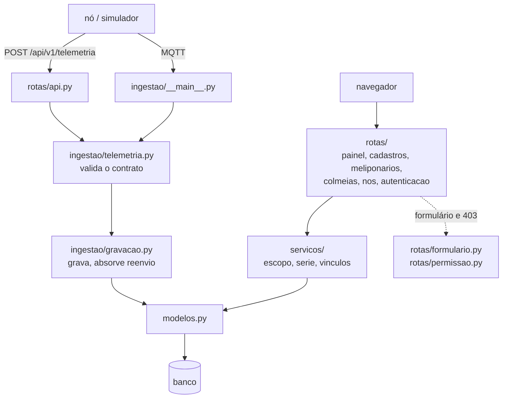

# 7. Os conceitos, no código

Os outros guias explicam **o sistema**. Este explica **o que o sistema ensina**: as ideias
de engenharia de software que estão escritas na plataforma, onde cada uma mora e qual
exercício a treina. Use como mapa — volte a ele quando um exercício citar um conceito, ou
quando for mexer num arquivo e quiser saber que regra ele protege.

As referências são por arquivo e função, nunca por número de linha: linha muda na primeira
edição, nome de função não.

## O desenho em uma figura

A seta só aponta para baixo. `servicos/` nunca importa `rotas/`; `modelos.py` não importa
ninguém do projeto. É essa direção única que deixa cada camada ser testada sozinha.

## O mapa

Cada entrada diz o conceito numa frase, onde ele mora, por que existe aqui, e onde você o
pratica.

### Camadas, e a dependência só para baixo

Cada camada sabe de uma coisa: `rotas/` sabe de HTTP, `servicos/` sabe das regras,
`modelos.py` sabe das tabelas.

- **Onde:** `rotas/nos.py:vincular` lê o formulário e confere a permissão; quem decide o
  que acontece é `servicos/vinculos.py:vincular`.
- **Por quê:** a regra que mora num serviço é testada sem servidor
  (`test_vinculos.py`) e pode ser chamada por um script ou um comando de terminal.
- **Pratique:** [exercício 03](../exercicios/03-onde-eu-mexo.md), e os
  [07](../exercicios/07-o-csv-na-camada-certa.md) e
  [08](../exercicios/08-a-rota-que-entrega-o-arquivo.md), que dividem uma funcionalidade
  exatamente nessa fronteira.

### Um arquivo por assunto

Quem procura "onde se edita uma colmeia" abre `rotas/colmeias.py`. O template está em
`templates/colmeias/`, com o mesmo nome.

- **Onde:** `rotas/` e `templates/`.
- **Por quê:** num arquivo de 300 linhas que faz tudo, cada mudança toca o arquivo de
  todo mundo, e ninguém sabe onde começar.

### Validação na fronteira

Tudo que vem de fora é conferido **uma vez**, na entrada, e o resto do código confia no
que passou.

- **Onde:** `ingestao/telemetria.py:decodificar`. Depois dela, `gravar` não confere mais
  nada do formato.
- **Por quê:** conferir em todo lugar espalha a regra; não conferir em lugar nenhum deixa
  um firmware com defeito gravar lixo no banco.
- **Pratique:** [exercício 02](../exercicios/02-uma-mensagem-ate-o-grafico.md), mandando
  mensagens erradas de propósito.

### Recusa nunca é silenciosa

Uma mensagem recusada vira uma linha em `ingest_rejects`, com o motivo.

- **Onde:** `ingestao/gravacao.py:registrar_recusa`, chamada por `rotas/api.py` e pelo
  ingestor MQTT.
- **Por quê:** o que some sem registro não pode ser depurado nem contado — e o projeto se
  compromete a reportar quantas leituras foram descartadas.

### Idempotência

Fazer a mesma coisa duas vezes dá o mesmo resultado que fazer uma.

- **Onde:** `ingestao/gravacao.py:gravar`. Reenviar a mesma `(node_id, seq)` responde
  "repetida" e não grava de novo. A restrição `UNIQUE` em `modelos.py:Medicao` é a
  segunda barreira.
- **Por quê:** o nó que ficou sem rede reenvia o que guardou. Sem isso, cada reconexão
  duplicaria pontos na série.
- **Pratique:** [exercício 04](../exercicios/04-mutantes-da-plataforma.md), mutação C —
  que mostra por que a suíte não percebe a primeira barreira sumir.

### Transação e rollback

O banco acumula as mudanças e só as torna definitivas no fim; se algo dá errado no meio,
desfaz tudo.

- **Onde:** `banco.py`. `abrir_sessao` faz commit no fim do `with` e rollback em qualquer
  exceção. `registrar_sessao_por_request` faz o mesmo para as telas: requisição que
  terminou bem grava, qualquer outra coisa desfaz.
- **Por quê:** nunca sobra metade de uma operação gravada.
- **Veja também:** a exceção deliberada em `rotas/api.py`, explicada no
  [guia 03](03-a-plataforma.md#quem-não-tem-requisição).

### Autorização concentrada

A regra de quem vê o quê mora num lugar só.

- **Onde:** `servicos/escopo.py`, aplicada pelas rotas através de `rotas/permissao.py`.
  Colmeia de outra organização responde **404, não 403**: um 403 confirmaria que o id
  existe.
- **Por quê:** consulta que esquece o filtro não quebra, não dá erro — só mostra a um
  produtor as colmeias de outro.
- **Pratique:** [exercício 04](../exercicios/04-mutantes-da-plataforma.md), mutação A.

### Histórico em vez de campo

Quando o passado importa, guarde o período, não o estado atual.

- **Onde:** `modelos.py:Vinculo`, com `installed_at` e `removed_at`, e
  `ingestao/gravacao.py:colmeia_no_instante`, que acha a colmeia **no instante da
  medição**.
- **Por quê:** se o vínculo fosse uma coluna do nó, remanejá-lo reescreveria a série
  inteira da colmeia antiga.
- **Pratique:** [exercício 05](../exercicios/05-o-mutante-que-ninguem-pega.md), mutante B.

### Ausência não é zero

"Não sabemos" e "é zero" são coisas diferentes, e o código as mantém diferentes.

- **Onde:** métricas anuláveis em `modelos.py:Medicao`; `servicos/serie.py:_media` pula o
  valor ausente; `_reamostrar` cria o balde vazio com `None`; `static/graficos.js` deixa
  `spanGaps` desligado, e o buraco aparece no gráfico.
- **Por quê:** zero viraria um mergulho falso na série; interpolar esconderia justamente a
  perda de mensagens que o projeto mede.
- **Pratique:** [exercício 04](../exercicios/04-mutantes-da-plataforma.md), mutação B.

### UTC na gravação, fuso só na tela

O banco guarda o instante sem ambiguidade; a conversão para o horário da Paraíba acontece
na última hora.

- **Onde:** `modelos.py:DataHoraUtc` recusa horário sem fuso;
  `rotas/painel.py:hora_local` e `rotas/formulario.py:ler_instante_local` convertem na
  entrada e na saída.
- **Por quê:** uma mudança de fuso nunca corrompe uma série já coletada.

### Migração

Mudar a classe em Python não muda a tabela que já existe.

- **Onde:** `platform/migrations/`. O [guia 03](03-a-plataforma.md) mostra o ciclo.
- **Por quê:** o banco de produção tem meses de dados de campo; ele recebe mudanças, não é
  recriado.
- **Veja também:** `modelos_futuros.py`, e o teste em `test_banco.py` que existe porque um
  `import` que parece sobra é o que registra três tabelas.

### Consultas N+1

Buscar uma lista e depois, para cada item, buscar os filhos um a um.

- **Onde:** os `selectinload(...)` de `rotas/cadastros.py:index` e
  `rotas/painel.py:index` buscam os filhos de todos numa consulta só.
- **Por quê:** 20 meliponários virariam 21 consultas em vez de 2.

### Falhar alto

Um erro que aparece na hora é barato; um que some em silêncio é caro.

- **Onde:** `criar_app` liga o modo estrito do Jinja (`StrictUndefined`): variável com
  nome errado no template vira erro, em vez de um pedaço da tela sumir. `DataHoraUtc`
  recusa horário sem fuso em vez de adivinhar.
- **Por quê:** foi assim que as flags de qualidade sumiram do painel numa tradução — e
  nenhum teste percebeu, porque nada falhou.

### Teste de fronteira, e medir a própria suíte

Um teste de fronteira confere os dois lados de um limite. Uma **mutação** é estragar o
código de propósito para ver se algum teste reclama.

- **Onde:** `test_ingestao.py` e `test_vinculos.py`; o roteiro inteiro está nos
  exercícios.
- **Pratique:** [exercício 04](../exercicios/04-mutantes-da-plataforma.md) e
  [05](../exercicios/05-o-mutante-que-ninguem-pega.md).

## Construções do Python que você vai encontrar

O código evita construções espertas quando existe uma forma mais direta. Estas ficaram
porque o Flask e o SQLAlchemy as exigem — e cada uma cabe numa frase.

| Construção | O que faz | Onde |
|---|---|---|
| `@bp.route("/colmeia/<int:colmeia_id>")` | um **decorador**: registra a função abaixo como a resposta daquela URL | todo arquivo de `rotas/` |
| `@login_required` | outro decorador: antes da função, manda para o login quem não entrou | todo arquivo de `rotas/` |
| `with abrir_sessao() as session:` | abre a sessão, roda o bloco, e fecha — com commit ou rollback — mesmo se der erro | `ingestao/`, `cli.py`, testes |
| `@contextmanager` e `yield` | o que faz uma função servir num `with`: o código antes do `yield` roda na entrada, o depois, na saída | `banco.py:abrir_sessao` |
| `Mapped[str \| None]` | diz ao SQLAlchemy o tipo da coluna; `\| None` quer dizer "pode ficar vazia" | `modelos.py` |
| `@dataclass` | cria uma classe só com campos, sem escrever o `__init__` à mão | `servicos/serie.py:Ponto`, `conftest.py:Cenario` |
| `@property` | um método que se lê como atributo: `no.vinculo_atual`, sem parênteses | `modelos.py` |
| `@classmethod` | um método chamado pela classe, antes de existir um objeto: `Configuracao.do_ambiente()` | `configuracao.py` |
| função dentro de função | `_confirmar` e `_encerrar` são criadas dentro de `registrar_sessao_por_request` para ficarem presas àquele `app` | `banco.py` |
| `getattr(obj, nome)` / `setattr(obj, nome, valor)` | ler e escrever um atributo cujo nome está numa variável | `servicos/serie.py:_media`, `ingestao/gravacao.py:gravar` |
| `from __future__ import annotations` | deixa uma classe citar outra que só é definida mais abaixo no arquivo | `modelos.py` |
| `# noqa: F401` | avisa o verificador de estilo que aquele `import` "sem uso" é de propósito | `banco.py` |

## Receita: uma funcionalidade nova

Um exemplo de verdade, tirado dos [defeitos conhecidos](../defeitos-conhecidos.md#d-17):
**hoje não dá para corrigir o rótulo (`label`) de um nó.** A receita diz *onde* e *em que
ordem*; o código fica com você.

1. **Pergunte do que a mudança precisa** (é a pergunta do exercício 03). Editar o rótulo
   é copiar um campo do formulário para o banco — não há regra de negócio. Então **não**
   precisa de serviço: a rota basta, como em `rotas/meliponarios.py:editar`. Se houvesse
   regra (por exemplo, "o rótulo não pode repetir dentro da organização"), ela iria para
   `servicos/`, com teste próprio, antes de tudo.
2. **Branch nova**, a partir da `main` atualizada — [guia 05](05-como-trabalhamos.md).
3. **O teste, primeiro, e vermelho.** Em `test_web.py`: quem administra envia um rótulo
   novo e o banco o guarda; o pesquisador recebe 403; o nó de outra organização também.
   Rode e veja falhar — um teste que nunca falhou não prova nada.
4. **A rota**, em `rotas/nos.py`, no molde de `vincular`: `permissao.exigir_quem_administra()`,
   `permissao.no_gerenciavel(...)`, `formulario.texto("rotulo")`, e o `if request.method
   == "POST"` que separa mostrar de gravar.
5. **O template**, em `templates/nos/editar.html` — a pasta tem o nome do arquivo da rota.
   E o link para ele em `templates/cadastros/index.html`.
6. **Verde.** `./verificar` termina em `=== tudo verde`.
7. **No navegador**, com o banco populado pelo simulador: edite, recarregue, confira.
8. **O que a mudança tornou falso na documentação.** A entrada D-17 dos defeitos
   conhecidos fala do rótulo — atualize-a no mesmo commit.

Repare no que **não** mudou: nenhuma tabela, nenhuma migração. `label` já é uma coluna
de `No`. Quando a funcionalidade precisar de coluna nova, o passo 1 ganha uma migração
— e ela vem antes da rota.

## O que ainda falta

| O quê | Situação |
|---|---|
| Mapa conceito → arquivo → exercício | pronto |
| Receita de funcionalidade nova | pronto, com um exemplo |
| Exercício de revisão de código usando este mapa | ainda não existe (ver a [trilha](../trilha.md)) |
| Conceitos das partes que ainda não existem: alertas, curadoria, relatórios | entram quando as partes entrarem |

→ De volta ao [índice do guia](README.md)
