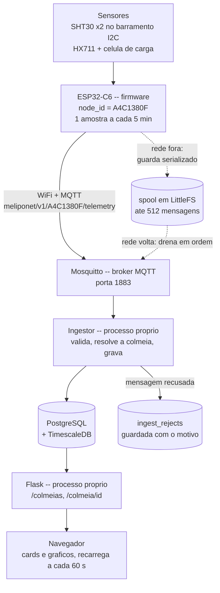
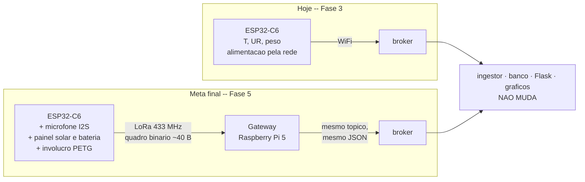

# 8. Do nó ao gráfico

Os documentos anteriores explicam cada peça em separado: o contrato, a plataforma, o
firmware. Este segue **uma medição inteira**, do momento em que a placa liga na bancada
até o ponto aparecer no gráfico do meliponicultor — e depois diz o que ainda falta para
chegar ao sistema descrito nas propostas.

Leia se você vai instalar o primeiro nó em campo. A seção 7 é o roteiro, com os comandos
exatos. As seções 3 a 6 explicam por que cada etapa existe, e uma delas — a ordem do
cadastro — tem uma armadilha que não dá erro nenhum: só produz dados órfãos.

## 1. O recorte de hoje

O sistema completo das propostas tem rádio LoRa, gateway, bioacústica e alimentação
solar. **Nada disso existe ainda**, e é de propósito: o primeiro protótipo corta pelo
caminho mais curto até um nó real gravando no banco, para validar sensores, calibração e
plataforma antes de entrar a complexidade de rádio e energia.

| Existe hoje | Não existe ainda |
|---|---|
| ESP32-C6 publicando **direto no broker por WiFi** | rádio LoRa e gateway Raspberry Pi |
| dois SHT30 (interno e externo): temperatura e umidade | microfone e análise bioacústica |
| célula de carga via HX711: peso | painel solar, bateria, deep sleep |
| spool em LittleFS para sobreviver a queda de rede | invólucro impresso e vedação |
| ingestão validada, banco, dashboard com gráficos | alertas, relatórios, dados do INMET |

## 2. O sistema inteiro



Duas leituras desse desenho que costumam causar confusão:

**Ingestor e Flask são dois programas, não dois arquivos.** Rodam como processos
independentes, e na pilha de produção como dois contêineres (`deploy/docker-compose.yml`,
serviços `ingest` e `web`). Reiniciar o site para publicar uma correção não pode derrubar
a recepção de telemetria, porque cada segundo fora do ar viraria lacuna permanente na
série.

**As setas pontilhadas são o caminho normal, não a exceção.** No semiárido a rede cai. O
spool não é tratamento de erro; é parte do projeto.

## 3. Como nasce a identidade do nó

Todo dado do sistema é atribuído a um `node_id`: oito caracteres hexadecimais maiúsculos,
como `A4C1380F`. Ele aparece no tópico MQTT, na mensagem, na tabela `nodes`, em cada linha
de `measurements` e na chave que impede duplicatas.

Esse identificador **não é gravado em lugar nenhum**. Ele é derivado do endereço MAC do
próprio chip, em `firmware/lib/MelipoHardware/Config.cpp:68`:

```cpp
const char *nodeId() {
  if (g_node_id[0] == '\0') {
    uint8_t mac[6] = {0};
    WiFi.macAddress(mac);
    snprintf(g_node_id, sizeof(g_node_id), "%02X%02X%02X%02X", mac[2], mac[3], mac[4], mac[5]);
  }
  return g_node_id;
}
```

Os quatro últimos bytes da MAC, em hexadecimal maiúsculo:

```
   MAC de fábrica, gravada no efuse do ESP32-C6
   ┌────┬────┬────┬────┬────┬────┐
   │ 30 │ AE │ A4 │ C1 │ 38 │ 0F │
   └────┴────┴────┴────┴────┴────┘
     [0]  [1]  [2]  [3]  [4]  [5]
   └──────────────┘ OUI da Espressif, igual em toda placa
             └───────────────────┘ viram o node_id

                node_id = "A4C1380F"
```

Repare que os dois colchetes se sobrepõem no byte `[2]`: ele pertence ao OUI **e** entra
no identificador. Guarde isso para a última observação desta seção.

**Por que derivar em vez de provisionar.** A alternativa seria gravar um identificador
único na NVS de cada placa antes de mandar para campo. Com o lote de 20 unidades previsto
no PIBITI, isso é vinte oportunidades de errar: gravar o mesmo id em duas placas, esquecer
de gravar numa, ou perder o id ao apagar a memória durante uma depuração. Derivar da MAC
elimina a etapa inteira — **a placa já vem com identidade de fábrica**, e ela sobrevive a
apagar a NVS, a regravar o firmware e a trocar o WiFi.

O formato é cobrado dos dois lados: o schema exige `^[0-9A-F]{8}$`
(`contracts/telemetry.v1.schema.json`) e a coluna no banco é `String(8)` única
(`platform/meliponet/models.py`).

### O que fica na NVS

O `node_id` não; **tudo o mais que é específico daquela unidade, sim** — na partição de
memória não-volátil, namespace `meliponet` (`Config.cpp`):

| Chave | O que é |
|---|---|
| `ssid`, `wifi_pw` | credenciais de WiFi, gravadas pelo console serial |
| `mqtt_host`, `mqtt_port`, `mqtt_user`, `mqtt_pw` | o broker |
| `interval_s` | intervalo de amostragem, padrão 300 s |
| `cal_offset`, `cal_scale` | tara e escala da célula de carga |
| `seq` | o contador de mensagens |

Nada disso está no código-fonte, e é por isso que **nenhuma senha aparece no
repositório**.

O `seq` merece uma nota. `nextSequence()` incrementa e **grava antes de devolver o
valor**. A consequência é deliberada: se o nó reiniciar entre a gravação e a publicação,
uma `seq` é pulada — aparece como lacuna, que é verdade — em vez de repetida, que
apareceria como duplicata e seria descartada em silêncio pela restrição
`UNIQUE (node_id, seq)`. Pular é honesto; repetir mentiria.

### Uma honestidade sobre colisão

Dentro de um mesmo OUI da Espressif, só três dos quatro bytes usados variam de fato entre
placas. Com 20 nós a chance de duas colidirem é da ordem de uma em cem mil — desprezível
na prática, mas não zero. E o modo de falha não seria um erro: as duas placas
compartilhariam a série, e as mensagens de uma seriam descartadas como duplicatas da
outra. **Se um nó ficar mudo sem explicação, confira o `node_id` no banner de boot antes
de suspeitar do rádio.**

## 4. Como o nó fala com o servidor

### Os tópicos

```
meliponet/v1/<node_id>/telemetry     a medição
meliponet/v1/<node_id>/status        Last Will retido: "online" / "offline"
```

O `node_id` no meio do caminho não é decoração: permite assinar um nó específico
(`meliponet/v1/A4C1380F/telemetry`) ou todos (`meliponet/v1/+/telemetry`), que é o que o
ingestor faz, sem que ninguém precise manter uma lista de nós no broker.

O tópico de `status` usa o **Last Will**: uma mensagem que o nó registra na conexão e que
o *broker* publica se o nó sumir sem se despedir. É o mecanismo que vai detectar nó mudo
— hoje ela é publicada, mas ninguém a assina ainda (ver seção 8).

### A mensagem

Uma medição na forma canônica descrita em [O contrato](02-o-contrato.md):

```json
{"schema":"meliponet.telemetry.v1","node_id":"A4C1380F","seq":10432,
 "ts":"2027-03-14T12:05:00Z","temp_in_c":30.12,"temp_out_c":34.80,
 "rh_in_pct":68.40,"rh_out_pct":41.20,"weight_kg":12.483,"vbat_v":3.92,"rssi":-58}
```

O `ts` é o instante da **medição**, não o da chegada, e o firmware prefere não amostrar a
inventar um horário: se o relógio ainda não sincronizou por NTP, a amostra é abortada
(`main.cpp`, função `sample()`). Um ponto sem horário confiável contamina a série inteira;
um ponto a menos é apenas um ponto a menos.

### O que o ingestor faz com ela

```
mensagem chega em meliponet/v1/+/telemetry
   │
   ├── decode()          tamanho, UTF-8, JSON, versão do schema, JSON Schema, ts com fuso
   │      └── falhou ──► ingest_rejects (motivo + 500 bytes do payload)  ─── fim
   │
   ├── known_node()      acha o nó, ou o cadastra agora, na primeira aparição
   ├── (node_id, seq) já existe? ──► reenvio do spool, ignora em silêncio ─── fim
   ├── resolve_hive()    em que colmeia este nó estava NO INSTANTE DA MEDIÇÃO?
   └── grava em measurements, e marca node.last_seen_at com o horário de CHEGADA
```

Três decisões visíveis aí: recusa nunca é silenciosa (vira linha com motivo, porque o
Edital 17 se compromete a reportar a proporção de descartes); reenvio não é erro (o spool
existe justamente para reenviar); e `last_seen_at` usa o horário de chegada, não o da
medição, porque uma mensagem antiga drenada do spool não prova que o nó está vivo agora.

### Quando a rede cai

```
  rede OK          rede FORA (3 horas)                 rede volta
  ────────►  ┌──────────────────────────────┐  ────────────────────►
             │                              │
  publica    │  push() no LittleFS          │   drena UMA por laço:
  direto     │  ┌────┬────┬────┬───┐        │   peek ──► publica ──► pop
             │  │12:0│12:1│12:1│...│  36    │   (pop só depois de o broker
             │  │0   │0   │5   │   │  msgs  │    confirmar; do contrário
             │  └────┴────┴────┴───┘        │    uma falha perderia a
             │   mais antiga ──► mais nova  │    mensagem que o spool
             │                              │    existia para salvar)
```

Capacidade: 512 mensagens, cerca de **42 horas** a uma amostra por 5 minutos. Quando
enche, descarta-se a **mais antiga**, não a mais nova — dado recente vale mais para o
manejo, e a perda fica registrada na `seq` de qualquer forma. O contador `dropped()`,
visível no comando `estado`, é um indicador de qualidade: se ele cresce, a rede fica fora
por mais tempo do que o buffer aguenta.

O que se drena é a mensagem **já serializada**, com o `ts` e a `seq` originais. Uma
mensagem represada por dias chega hoje com o carimbo de anteontem, e é assim que tem que
ser.

## 5. Como cadastrar a colmeia

A ordem importa. Siga esta:

| # | Onde | O quê |
|---|---|---|
| 1 | terminal do servidor | `criar-usuario` — cria a organização e o primeiro acesso |
| 2 | `/entrar` | login |
| 3 | `/gerenciar/` → "Novo meliponário" | nome, município, latitude, longitude |
| 4 | `/gerenciar/` → "Nova colmeia" | nome, espécie, tipo de caixa |
| 5 | **ligue o nó** | ele se cadastra sozinho na primeira mensagem válida |
| 6 | `/gerenciar/no/<id>/vincular` | colmeia, instante de instalação, posicionamento |

Não existe cadastro pela web: a primeira conta só pode nascer do terminal do servidor,
porque criar usuário exige estar logado.

```bash
cd platform
.venv/bin/python -m flask --app "meliponet:create_app" criar-usuario \
  --email voce@exemplo.br --nome "Seu Nome" --organizacao "Meliponário X" --perfil admin
```

### O passo 5 surpreende todo mundo

**Não há tela de "cadastrar nó".** Procurar por ela é a primeira coisa que a maioria faz,
e ela não existe.

O nó se cadastra sozinho: `known_node()` (`platform/meliponet/ingest/store.py`) cria a
linha em `nodes` na primeira telemetria válida, sem organização e sem colmeia. Ele então
aparece em `/gerenciar/` sob **"Nós aguardando vínculo"**, com o horário em que foi visto
pela última vez.

A escolha é deliberada. Um nó que chega do campo com dados válidos não deve ter as
leituras descartadas só porque ninguém preencheu um formulário antes — e, na prática, a
tela de cadastro seria preenchida copiando à mão um identificador que o próprio nó já
sabe, o que é uma oportunidade de digitar errado sem ganho nenhum. Vincular também
**adota** o nó para a sua organização.

### A armadilha: vincule antes de deixar o nó publicando

O `hive_id` é carimbado na linha da medição **no momento da ingestão**. Medições que
chegarem antes de existir vínculo ficam com `hive_id = NULL`, e **não são reatribuídas
depois** — vincular não traz o passado de volta.

Então o roteiro prático é: ligue o nó só o tempo de ele aparecer na lista de pendentes,
vincule, e **aí** deixe medindo. Se você já deixou publicando por um dia antes de
vincular, aquelas leituras estão guardadas no banco mas não vão aparecer no gráfico da
colmeia. Nada quebra, nada avisa; o gráfico só começa mais tarde do que você esperava.

(Isto é uma limitação real, não uma regra de projeto — está listada na seção 8.)

### Por que o vínculo é um período, e não um campo

Um nó é remanejado em campo: sai de uma caixa que colapsou, entra em outra. Se a colmeia
fosse uma coluna em `nodes`, remanejar **reescreveria o passado** — a série histórica
inteira da colmeia antiga passaria a ser atribuída à nova.

Por isso existe `node_assignments`, com `installed_at` e `removed_at`:

```
 nó A4C1380F
 │
 ├──── colmeia "Jandaíra 1" ────────┤├──── colmeia "Uruçu 3" ───────────►
 │  installed_at        removed_at   │  installed_at        (em aberto)
 │  2027-01-10          2027-03-14   │  2027-03-14
 │                                   │
 └───────────────────────────────────┴──────────────────────────────────
      medição de 02/mar             ▲            medição de 20/mar
      resolve para "Jandaíra 1"     │            resolve para "Uruçu 3"
                                    │
              mensagem MEDIDA em 12/mar mas entregue em 16/mar
              (represada no spool) resolve para "Jandaíra 1",
              porque o que vale é o instante da medição
```

Vincular de novo fecha o vínculo anterior automaticamente. É também o que faz o spool
funcionar direito: a mensagem represada pousa na colmeia em que o nó estava **quando
mediu**.

## 6. Como visualizar os dados

| Rota | O que é |
|---|---|
| `/` | página pública, sem login — apresenta o projeto, mostra só números agregados |
| `/colmeias` | o painel: uma linha por colmeia, com o estado mais recente |
| `/colmeia/<id>` | a página da colmeia |
| `/colmeia/<id>/painel` | o **fragmento** que o HTMX rebusca sozinho a cada 60 s |

A página da colmeia mostra quatro cards — temperatura interna, externa, **diferencial
térmico** e peso —, uma linha de frescor com a completude do período, e três gráficos
Chart.js (temperatura com o diferencial tracejado, peso, umidade).

O diferencial térmico é interno menos externo. É a estimativa do esforço
termorregulatório da colônia, e é o indicador que o Edital 17 pede: um valor absoluto de
30 °C significa coisas opostas numa madrugada de 18 °C e numa tarde de 36 °C.

Três janelas, cada uma com seu passo de reamostragem:

| Janela | Período | Passo |
|---|---|---|
| `24h` | últimas 24 horas | 5 min |
| `7d` | últimos 7 dias | 30 min |
| `30d` | últimos 30 dias | 2 h |

### Buraco no gráfico é informação

`spanGaps` fica **desligado** de propósito. Um intervalo sem dados vira um buraco visível,
não um segmento de reta ligando os pontos vizinhos. Interpolar por cima de uma lacuna
seria afirmar uma medição que ninguém fez.

Pela mesma razão a reamostragem percorre **todos** os intervalos da janela e devolve
`None` para os vazios, em vez de simplesmente omiti-los — omitir faria os pontos vizinhos
se encostarem e a lacuna desaparecer.

E a completude não é estimada pelo espaçamento dos horários: sai dos **saltos de `seq`**.
Se chegaram as 100, 101 e 104, faltam exatamente duas. Isso é contagem, não chute.

## 7. Roteiro: da bancada ao gráfico

**1. Teste a lógica no PC, antes de gravar nada.** Segundos, e pega quase todo erro de
conversão e de fila:

```bash
pio test -e native -d firmware
```

**2. Grave e abra o monitor serial** (115200 baud):

```bash
pio run -e esp32c6 -d firmware -t upload -t monitor
```

**3. Anote o `node_id`.** Ele aparece no banner de boot:

```
MelipoSense A4C1380F
```

**4. Confira os sensores antes de qualquer rede.** Ainda na bancada, sem WiFi nem
broker configurados:

```
ler          uma leitura agora
sondar       redetecta os sensores, se você ligou algum depois do boot
```

Cada grandeza sai em unidade física e no inteiro escalado que iria para a mensagem, e um
sensor que não respondeu sai como `ausente` — nunca como zero. Se a eletrônica estiver
errada, é aqui que se descobre, e não depois de o gráfico não aparecer. Detalhes em
[O firmware](04-o-firmware.md).

**5. Provisione pelo console serial.** Cada comando é uma linha; os dois primeiros pedem
reinício depois:

```
wifi <ssid> <senha>      grava as credenciais da rede
broker <host> [porta]    grava o endereço do broker MQTT
mqtt <usuario> <senha>   grava as credenciais do broker
ajuda                    lista os comandos
```

O broker do projeto recusa clientes anônimos (`deploy/mosquitto.conf`), então o `mqtt` é
obrigatório fora de um broker de desenvolvimento. `mqtt` sem argumentos apaga as
credenciais gravadas, que é como se volta a um broker com `allow_anonymous true`. A senha
nunca é ecoada de volta no serial.

**6. Calibre a célula de carga**, com a colmeia montada mas vazia:

```
tara                    zera com a caixa vazia
calibrar 5.0            com uma massa-padrão conhecida em cima
```

Verifique em **vários pontos da faixa**, não só no da calibração: um ponto só ajusta a
escala e esconde a não-linearidade da célula.

**7. Confira tudo de uma vez:**

```
estado
```

```
no        A4C1380F
wifi      conectado
broker    conectado em mqtt.ifpb.edu.br:1883
mqtt auth no-puxinana, senha definida
relogio   sincronizado
sht int   ok
sht ext   ok
calibrac. ok
spool     0 pendentes, 0 descartadas
```

Se o relógio estiver `NAO sincronizado`, o nó não vai amostrar — e está certo em não
amostrar.

**8. Veja o JSON cru no broker, antes de olhar o banco.** Isto separa "o nó não publica"
de "a plataforma não grava", que são problemas em lugares diferentes:

```bash
mosquitto_sub -t 'meliponet/v1/#' -v
```

**9. Cadastre e vincule na web.** Meliponário → colmeia → `/gerenciar/` → "Vincular a uma
colmeia" no nó que apareceu como pendente. Registre o **posicionamento do sensor** no
campo de observações: sem isso, comparar duas colmeias meses depois vira adivinhação.

**10. Abra `/colmeia/<id>`.** O primeiro ponto aparece em até cinco minutos, e o painel se
atualiza sozinho a cada minuto.

## 8. Lacunas conhecidas hoje

Um guia que descreve o sistema que gostaríamos de ter é pior do que nenhum guia. As
diferenças conhecidas entre o que a documentação afirma e o que o código faz ficam todas
em **[docs/defeitos-conhecidos.md](../defeitos-conhecidos.md)**, com sintoma, causa e
como corrigir cada uma.

As três que mais afetam quem está seguindo este documento:

| Lacuna | Efeito prático |
|---|---|
| [D-01](../defeitos-conhecidos.md#d-01) — a telemetria sai em **QoS 0**, não QoS 1 | o spool cobre o trecho nó→broker, mas o broker **não** guarda a mensagem enquanto o ingestor reinicia |
| [D-02](../defeitos-conhecidos.md#d-02) — medições anteriores ao vínculo não são reatribuídas | as primeiras leituras existem no banco mas não aparecem no gráfico (é a armadilha da seção 5) |
| [D-06](../defeitos-conhecidos.md#d-06) — ninguém assina o tópico `.../status` | o Last Will é publicado, mas "nó mudo" ainda não é detectado |

São defeitos, não decisões. Se você for mexer em algum, escreva primeiro o teste que o
pega, e rode-o antes da correção para vê-lo falhar.

## 9. O que muda até a meta final



Esse desenho é a recompensa de ter um contrato. O rádio muda, a energia muda, o invólucro
muda, entra um computador novo no meio do caminho — e **do broker para dentro nada
disso é perceptível**, porque o gateway publica no mesmo tópico e no mesmo formato. O
quadro binário do LoRa carrega exatamente os mesmos inteiros escalados, então os dois
transportes rendem valores idênticos.

O que falta, por fase:

| Fase | O que entra | Por que nesta ordem |
|---|---|---|
| **4** — plataforma completa | comparação entre colmeias, alertas (temperatura fora de faixa, queda abrupta de peso, nó mudo, bateria baixa), relatórios em PDF e CSV, dados climáticos do INMET | o protótipo já gera série real; o valor para o meliponicultor está em ser avisado, não em olhar gráfico |
| **5** — expansão do nó | bioacústica (INMP441, RMS e energia em 4 bandas), LoRa 433 MHz com endereçamento por `node_id`, gateway Raspberry Pi, deep sleep e solar para ≥ 15 dias autônomos, invólucro impresso, lote de 20 unidades | só faz sentido depois que sensores, calibração e plataforma estiverem validados — senão um erro de rádio e um erro de calibração aparecem juntos e ninguém separa os dois |
| **6** — qualidade e curadoria | `services/quality.py` na ingestão (faixas plausíveis, salto máximo, deriva do relógio) marcando `quality_flags` **em vez de descartar**, painel de completude, base curada exportada, protocolo de instrumentação documentado | precisa de meses de dados reais para calibrar os limiares; fazer antes seria inventar números |

Os campos que a Fase 5 vai preencher — `sound_rms` e `sound_bands` — **já existem no
schema como opcionais**, e `sound_rms` já tem coluna em `measurements` (a de
`sound_bands` ainda precisa ser criada, por migração). Foi assim que o protótipo sem
microfone e o nó completo couberam na mesma versão do contrato, sem que ninguém precise
reprogramar um nó em campo no dia da migração.

→ Próximo: [Engenharia de software](05-engenharia-de-software.md)
