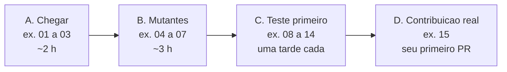
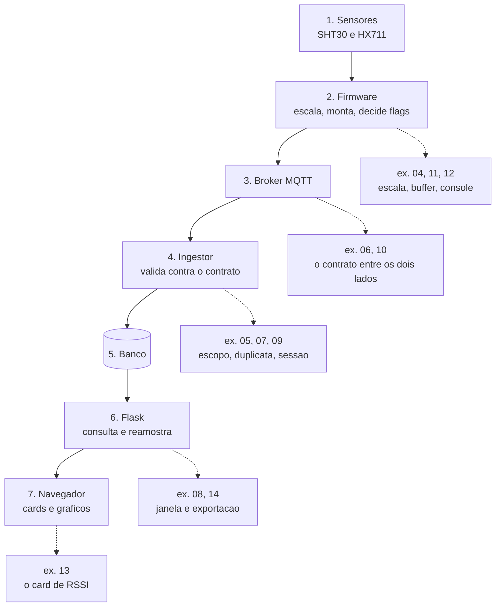

# 11. Trilha de exercícios

Os documentos anteriores explicam o sistema. Este é para **fazer**.

Entre ler o guia e pegar uma tarefa de verdade existe um degrau, e ele é maior do que
parece: você entendeu por que uma lacuna vira `null`, mas nunca viu o teste que garante
isso; sabe que o contrato é verificado dos dois lados, mas nunca quebrou nenhum dos dois
para ver o que acontece. A trilha existe para atravessar esse degrau **na sua máquina**,
com o repositório te respondendo — não com alguém do lado.

Cada exercício termina com um **critério de pronto que você mesmo confere**: a saída de
um comando, um teste com nome que precisa falhar antes e passar depois, ou uma resposta
dobrável para comparar com a sua. Nenhum exercício depende de alguém disponível para
corrigir.



**Faça na ordem.** O Bloco B só ensina alguma coisa depois que o Bloco A te deu o mapa, e
o Bloco C supõe que você já viu um teste falhar de propósito.

## Treino e contribuição não são a mesma coisa

| | Treino | Contribuição |
|---|---|---|
| Onde acontece | branch local, sua | branch, PR, revisão |
| No fim | você **descarta** | entra na `main` |
| Quantas pessoas fazem | todas, em paralelo | uma, combinada antes |

Os exercícios dizem qual dos dois são. Vale reparar num detalhe: **duas pessoas fazendo o
mesmo exercício de contribuição desperdiçam o trabalho de uma delas.** Antes de começar um
marcado como contribuição, combine com o orientador ou avise no grupo — é o mesmo hábito
que evita dois PRs concorrentes no trabalho de verdade.

E a regra que vale para o Bloco B inteiro: **mutante nunca é commitado.** Você vai
estragar código de propósito para ver quem reclama. Antes de sair da máquina, desfaça:

```bash
git status                       # o que eu mexi?
git diff                         # exatamente o quê?
git restore <arquivo>            # desfaz as mudanças não commitadas daquele arquivo
git restore .                    # desfaz tudo (cuidado: é tudo mesmo)
```

Se `git status` estiver limpo, não sobrou mutante nenhum.

## Antes de começar

Você precisa do ambiente montado — é o assunto de
[Primeira contribuição](06-primeira-contribuicao.md). O teste de que está tudo no lugar é
um comando só, na raiz do repositório:

```bash
./verificar
```

Ele roda as quatro verificações que o CI roda: os vetores dourados, o `ruff`, o `pytest`
da plataforma e os testes nativos do firmware. Se as quatro passarem, você está pronto. Se
faltar alguma ferramenta, ele diz qual e como instalar.

## Os exercícios

Cada um mora em `docs/exercicios/`, num arquivo próprio.

### Bloco A — Chegar (todos, ~2 h)

| # | Exercício | Área | Tempo | Tipo |
|---|---|---|---|---|
| 01 | [Tudo verde](../exercicios/01-tudo-verde.md) — ambiente, primeira leitura de histórico | todas | 30 min | treino |
| 02 | [Uma mensagem ponta a ponta](../exercicios/02-uma-mensagem-ponta-a-ponta.md) — seguir um vetor dourado do C++ ao gráfico | todas | 45 min | treino |
| 03 | [Onde eu mexo?](../exercicios/03-onde-eu-mexo.md) — oito pedidos de mudança, e em que camada cada um cai | todas | 30 min | treino |

### Bloco B — Mutantes: o que os testes protegem (todos, ~3 h)

Você quebra o código de propósito, **prevê** qual teste vai cair, roda, e compara. É a
forma mais rápida de descobrir que a suíte não é um número — é uma lista de afirmações
sobre o sistema.

| # | Exercício | Área | Tempo | Tipo |
|---|---|---|---|---|
| 04 | [Mutantes do firmware](../exercicios/04-mutantes-do-firmware.md) | firmware | 45 min | treino |
| 05 | [Mutantes da plataforma](../exercicios/05-mutantes-da-plataforma.md) | plataforma | 45 min | treino |
| 06 | [O mutante do contrato](../exercicios/06-mutante-do-contrato.md) | contrato | 30 min | treino |
| 07 | [O mutante que ninguém pega](../exercicios/07-o-mutante-que-ninguem-pega.md) | ambas | 1 h | treino, e pode virar PR |

### Bloco C — Teste primeiro (por área, uma tarde cada)

Aqui você escreve o teste **antes** da mudança e o vê falhar. Escolha os da sua área;
faça pelo menos um da outra.

| # | Exercício | Área | Tempo | Tipo |
|---|---|---|---|---|
| 08 | [Uma janela nova](../exercicios/08-uma-janela-nova.md) | plataforma | 1 h | treino |
| 09 | [Desativar usuário encerra a sessão](../exercicios/09-desativar-usuario-encerra-a-sessao.md) — D-15 | plataforma | 2 h | contribuição |
| 10 | [Um vetor dourado novo](../exercicios/10-um-vetor-dourado-novo.md) | contrato | 1 h | treino ou contribuição |
| 11 | [Folga no buffer do MQTT](../exercicios/11-folga-no-buffer-do-mqtt.md) — D-03 | firmware | 1 h | contribuição |
| 12 | [O comando `intervalo`](../exercicios/12-comando-intervalo.md) — D-10 | firmware | 2 h | contribuição |
| 13 | [RSSI no painel](../exercicios/13-rssi-no-painel.md) | plataforma | 1 h | treino ou contribuição |
| 14 | [Exportar CSV](../exercicios/14-exportar-csv.md) | plataforma | 2 h | contribuição |

### Bloco D — Contribuição real

| # | Exercício | Área | Tempo | Tipo |
|---|---|---|---|---|
| 15 | [Sua primeira contribuição](../exercicios/15-sua-primeira-contribuicao.md) | escolha sua | — | contribuição |

## Por que esta ordem

Os exercícios não estão espalhados ao acaso: cada um pendura numa etapa do caminho do
dado, e a trilha percorre esse caminho de ponta a ponta antes de pedir que você mude
qualquer coisa.



O exercício 02 percorre o desenho inteiro sem mudar nada. O 03 te faz apontar, para oito
pedidos diferentes, em que caixa desse desenho a mudança começa. Só depois disso os
exercícios de mudança fazem sentido: quase todo erro de quem chega não é escrever a linha
errada — é escrever a linha certa na camada errada.

## Quando travar

Cada exercício tem uma seção **Pistas** dobrável no fim. Abra sem culpa: ela existe para
que você não perca a tarde numa vírgula.

O que a pista não resolve, a regra do guia resolve: **quando não souber, pergunte antes de
adivinhar.** Ao perguntar, traga o comando exato, a mensagem de erro inteira e o que você
já tentou — como pede
[Primeira contribuição](06-primeira-contribuicao.md#quando-travar).

E se você tropeçar em algo errado num exercício, **corrigir isso é uma contribuição
legítima**. A próxima pessoa tropeçaria no mesmo lugar.

## O que ainda falta nesta trilha

A trilha cobre hoje o que se faz no computador. O que está previsto e ainda não foi
escrito:

- **Exercícios de bancada, com a placa na mão.** Conferir a ligação pelo `ler`, provocar
  um `ausente` desligando o SHT30 externo, ver a contagem bruta do HX711 se mover ao
  apertar a plataforma, e o exercício mais instrutivo de todos: **trocar os dois SHT30 de
  lugar de propósito** e descobrir que nada dá erro — só a série sai com o diferencial
  térmico invertido. O material de referência já existe em
  [O hardware](10-o-hardware.md) e em [O firmware](04-o-firmware.md#testar-os-sensores-na-bancada).
- **Um exercício de revisão de código.** Hoje a trilha só treina o lado de quem escreve o
  PR. Revisar é a outra metade, e tem roteiro próprio: o que perguntar, o que é
  obrigatório e o que é opinião, quando aprovar.
- **Exercícios da Fase 4**, quando ela chegar: escrever uma regra de alerta com o teste
  que a pega, e distinguir uma colheita de uma enxameação numa queda abrupta de peso.
- **Exercícios da Fase 6**, sobre curadoria: marcar `quality_flags` em vez de descartar, e
  calcular completude por janela.

→ Consulta rápida: [Glossário](07-glossario.md)
