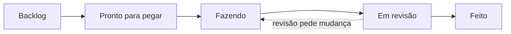

# Como nós nos organizamos

O projeto tem seis pessoas trabalhando ao mesmo tempo — três bolsistas e três voluntários —
e um repositório com backlog para muito mais gente do que isso. Este documento responde às
três perguntas que aparecem quando alguém termina uma tarefa: *o que eu pego agora*, *como
eu sei que ninguém já está fazendo isso*, e *quando eu devo pedir ajuda*.

## O quadro

O acompanhamento vive num **GitHub Projects** ligado a este repositório. Ele existe porque
o trabalho já mora aqui: uma issue vira uma branch, que vira um pull request, que fecha a
issue e move o cartão sozinho. Um quadro fora do GitHub exigiria que alguém movesse cartão
na mão, e um quadro que ninguém move é pior do que nenhum.

A coluna que importa mais no começo é **Pronto para pegar**: é a resposta a "o que eu posso
começar sem perguntar a ninguém". O `Backlog` é maior e mais assustador de propósito — nada
lá está liberado ainda.

Duas regras que evitam quase todo atropelo:

- **Uma tarefa por pessoa de cada vez.** Ao pegar um cartão, atribua-o a você e mova para
  `Fazendo` antes de escrever a primeira linha. É esse gesto, e não um aviso no grupo, que
  impede duas pessoas de fazerem a mesma coisa.
- **Travou trinta minutos, pede ajuda.** No mesmo dia, no grupo. Está escrito também em
  [Primeira contribuição](06-primeira-contribuicao.md), e vale repetir: uma pergunta custa
  cinco minutos, e uma tarde perdida custa uma tarde.

## Treino e contribuição não se misturam

A distinção vem da [trilha de exercícios](11-trilha-de-exercicios.md) e organiza o quadro
inteiro. **Treino** todo mundo faz em paralelo, na própria máquina, e descarta no fim — não
precisa de cartão nem de dono. **Contribuição** entra na `main`, então é uma pessoa só,
combinada antes, com cartão atribuído. Duas pessoas no mesmo exercício de contribuição
significa que o trabalho de uma vai para o lixo.

## As frentes

Cada bolsista é dono de uma frente e responde pelo relatório do edital correspondente. Cada
voluntário faz dupla com um bolsista. A dupla não divide a tarefa ao meio: ela revisa o
trabalho um do outro antes de o pull request chegar ao orientador.

| Frente | Proposta | Onde no repositório |
|---|---|---|
| **O nó** | MelipoSense (PIBITI) | `firmware/` |
| **A plataforma** | MelipoNet (PIBIC) | `platform/`, `simulator/` |
| **Contrato, dados e bancada** | Coleta de Dados (FAPESQ) | `contracts/`, `docs/`, depois `curation/` |

As frentes valem a partir da terceira semana. As duas primeiras são comuns a todos: ninguém
escolhe uma frente antes de ter visto o sistema inteiro andar.

## As duas primeiras semanas

**Semana 1 — entender o que existe.** Leia, na ordem, [O sistema](01-o-sistema.md),
[O contrato](02-o-contrato.md), [Do nó ao gráfico](08-do-no-ao-grafico.md),
[Engenharia de software](05-engenharia-de-software.md) e
[Primeira contribuição](06-primeira-contribuicao.md). Ler não fixa: a parte que conta são
os exercícios [01](../exercicios/01-tudo-verde.md), [02](../exercicios/02-uma-mensagem-ponta-a-ponta.md)
e [03](../exercicios/03-onde-eu-mexo.md), umas duas horas ao todo, e o **pull request de
treino** em [`docs/equipe.md`](../equipe.md).

Em paralelo, em duplas: estudar o [hardware do nó de hoje](10-o-hardware.md) e transformá-lo
na [lista de compras](../lista-de-compras.md). Não é leitura passiva — a tarefa inclui
conferir o que o guia diz **contra o que o firmware faz**. Se os pinos do guia não baterem
com `firmware/src/main.cpp`, isso é um achado, e vira uma issue.

**Semana 2 — o que os testes protegem.** Bloco B da trilha (exercícios 04 a 07): quebrar o
código de propósito e prever qual teste cai. E fechar a lista de compras, que é o que
desbloqueia todas as tarefas de bancada.

Da semana 3 em diante, cada um pega uma tarefa de contribuição com o seu nome no cartão.

## De onde vem o trabalho

Três fontes, e vale saber distinguir:

- **[Defeitos conhecidos](../defeitos-conhecidos.md)** — o que já está errado e ainda não
  foi corrigido, com ID estável (`D-03`, `D-15`). Cada defeito aberto tem uma issue que
  aponta para lá. O arquivo continua sendo a fonte da verdade: a issue diz *quem está com
  o quê*, e o arquivo diz *o que é o defeito*. Quem corrige move a linha para Resolvidos no
  mesmo commit.
- **[A trilha de exercícios](11-trilha-de-exercicios.md)** — sete dos quinze exercícios
  produzem código que o projeto quer de verdade.
- **As seções "o que ainda falta"** no fim de cada guia — o roadmap, em prosa.

## O que ainda falta nesta organização

- **Ninguém revisa código ainda além do orientador.** A trilha treina o autor do pull
  request, não o revisor, e enquanto isso não mudar a revisão é um gargalo de uma pessoa.
- **Não há definição de pronto para tarefa de bancada.** As tarefas de código herdam o
  critério do `./verificar`; as de hardware, quando as peças chegarem, vão precisar do seu
  equivalente — provavelmente uma foto da montagem e a saída do comando `ler`.
- **A cadência semanal ainda não foi testada** com seis pessoas. Se a fila de revisão
  crescer, a resposta provável é revisão em dupla antes do orientador, e não reunião mais
  longa.

→ Próximo: [Primeira contribuição](06-primeira-contribuicao.md)
