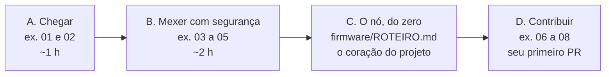

# A trilha

Esta é a porta de entrada do projeto. O [guia](guia/README.md) explica o sistema; a
trilha é para **fazer** — e a ordem certa é intercalar os dois, não ler tudo antes de
começar.

Ela vai do ambiente montado até o seu nó publicando no gráfico. Cada exercício termina com
um **critério de pronto que você mesmo confere**: a saída de um comando, um teste com nome
que precisa falhar antes e passar depois, ou uma resposta dobrável para comparar com a
sua. Nenhum exercício depende de alguém disponível para corrigir.



**Faça na ordem.** O Bloco B só ensina alguma coisa depois que o A te deu o mapa, e o C
supõe que você já viu uma mensagem chegar ao gráfico.

## Antes de começar

Ambiente montado — é o assunto de
[Como trabalhamos](guia/05-como-trabalhamos.md#preparando-a-máquina). O teste de que está
tudo no lugar é um comando só, na raiz do repositório:

```bash
./verificar
```

Duas verificações, as mesmas que o CI roda a cada push. Se as duas passarem, você está
pronto. Se faltar alguma ferramenta, ele diz qual e como instalar.

## Bloco A — Chegar (~1 h)

Leia antes: [O sistema](guia/01-o-sistema.md) e [A mensagem](guia/02-a-mensagem.md).

| # | Exercício | Tempo |
|---|---|---|
| 01 | [A plataforma no ar](exercicios/01-plataforma-no-ar.md) — ambiente montado, painel aberto no navegador | 30 min |
| 02 | [Uma mensagem até o gráfico](exercicios/02-uma-mensagem-ate-o-grafico.md) — você manda uma leitura à mão e a encontra na tela | 30 min |

## Bloco B — Mexer com segurança (~2 h)

Leia antes: [A plataforma](guia/03-a-plataforma.md) e
[Como trabalhamos](guia/05-como-trabalhamos.md).

| # | Exercício | Tempo |
|---|---|---|
| 03 | [Onde eu mexo?](exercicios/03-onde-eu-mexo.md) — seis pedidos de mudança, e onde cada um começa | 30 min |
| 04 | [Mutantes da plataforma](exercicios/04-mutantes-da-plataforma.md) — quebre de propósito e veja quem reclama | 45 min |
| 05 | [O mutante que ninguém pega](exercicios/05-o-mutante-que-ninguem-pega.md) — encontre o buraco na suíte e feche-o | 1 h |

**Mutante nunca é commitado.** Você vai estragar código de propósito. Antes de sair da
máquina, desfaça:

```bash
git status                       # o que eu mexi?
git diff                         # exatamente o quê?
git restore .                    # desfaz tudo (cuidado: é tudo mesmo)
```

Se `git status` estiver limpo, não sobrou mutante nenhum.

## Bloco C — O nó, do zero

Leia antes: [O nó sensor](guia/04-o-no-sensor.md).

Aqui não há exercício em `docs/`: há o
**[roteiro do nó sensor](../firmware/ROTEIRO.md)**, com dez etapas, da placa que só
imprime no serial até o nó publicando em MQTT. É a parte central do projeto e a mais
longa — semanas, não horas.

O `ROTEIRO.md` é o índice: as peças, a ligação, a mensagem e os códigos de resposta. Os
passos ficam em `firmware/etapas/`, e cada um tem o seu **pronto quando**:

| Etapas | O quê | Tempo |
|---|---|---|
| [E1 a E3](../firmware/etapas/E1-E3-a-placa-na-rede.md) | a placa fala, entra na rede e sabe que horas são | ~5 h |
| [E4 a E6](../firmware/etapas/E4-E6-a-primeira-mensagem.md) | os sensores respondem, a mensagem existe, o primeiro ponto no gráfico | ~9 h |
| [E7](../firmware/etapas/E7-o-peso.md) | o peso: contagem bruta, tara, calibração, NVS | ~6 h |
| [E8](../firmware/etapas/E8-o-no-completo.md) | o laço de 5 min, a `seq` que sobrevive ao reset, a bateria | ~5 h |
| [E9 e E10](../firmware/etapas/E9-E10-opcionais.md) | spool e MQTT — opcionais | ~8 h |

**E6 é o marco que muda tudo.** Até ele você depura pelo monitor serial; a partir dele,
pela tela da plataforma.

Você já sabe, do Bloco A, qual mensagem a plataforma aceita e como ela responde quando a
mensagem está errada. Agora é fazer o seu nó produzi-la.

## Bloco D — Contribuir

| # | Exercício | Tipo |
|---|---|---|
| 06 | [Uma janela nova](exercicios/06-uma-janela-nova.md) — a menor mudança que passa pelo caminho inteiro | treino |
| 07 | [Exportar CSV](exercicios/07-exportar-csv.md) — teste primeiro, serviço, rota, caso vazio | contribuição |
| 08 | [Sua primeira contribuição](exercicios/08-sua-primeira-contribuicao.md) — sem gabarito | contribuição |

**Treino e contribuição não são a mesma coisa.** Treino todo mundo faz em paralelo, na
própria máquina, e descarta no fim. Contribuição entra na `main`: é uma pessoa só,
combinada antes. Duas pessoas no mesmo exercício de contribuição desperdiçam o trabalho de
uma delas.

## Quando travar

Cada exercício tem uma seção **Pistas** dobrável no fim. Abra sem culpa: ela existe para
que você não perca a tarde numa vírgula.

O que a pista não resolve, a regra do guia resolve: **quando não souber, pergunte antes de
adivinhar.** Ao perguntar, traga o comando exato, a mensagem de erro inteira e o que você
já tentou.

E se você tropeçar em algo errado num exercício, **corrigir isso é uma contribuição
legítima**. A próxima pessoa tropeçaria no mesmo lugar.

## O que ainda falta nesta trilha

- **Um exercício de revisão de código.** Hoje a trilha só treina o lado de quem escreve o
  PR. Revisar é a outra metade, e tem roteiro próprio: o que perguntar, o que é obrigatório
  e o que é opinião, quando aprovar.
- **Exercícios de alerta e de curadoria**, quando essas partes da plataforma existirem.
