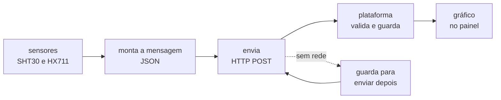

# Roteiro do nó sensor

Esta pasta está vazia de propósito. **O firmware do nó é seu.**

Você vai escrever, do zero, o programa que roda no ESP32-C6 dentro da colmeia: lê os
sensores, monta uma mensagem e entrega essa mensagem à plataforma. O resto do sistema já
existe e funciona — a plataforma recebe, guarda e desenha o gráfico. Ela é o seu
corretor: enquanto o nó não estiver certo, o ponto não aparece na tela.

Use a ferramenta que preferir: Arduino IDE, PlatformIO, ESP-IDF. O roteiro não escolhe
por você, porque o que está sendo cobrado é o comportamento do nó, não o formato do
projeto.

Este arquivo é o **índice**: as peças, a mensagem, como entregar, e a
[tabela das etapas](#as-etapas). Os passos miúdos, com os "pronto quando", estão nos
arquivos de `etapas/`.

## O que o nó faz



Quatro frases: lê os sensores, monta um JSON, manda para a plataforma, repete a cada
cinco minutos. Tudo o mais no roteiro é detalhe de uma dessas quatro.

## As peças e como ligar

| Peça | O quê |
|---|---|
| Placa | ESP32-C6-DevKitC-1, 8 MB de flash |
| Temperatura e umidade | 2× SHT30, I²C, endereços 0x44 (interno) e 0x45 (externo) |
| Peso | célula de carga de 50 kg + módulo HX711 |
| Energia | célula 18650 + divisor resistivo de 2× 100 kΩ |

A ligação sugerida — você pode mudar, desde que anote no seu código:

| Sinal | GPIO | Vai para |
|---|---|---|
| SDA (I²C) | 6 | SDA dos **dois** SHT30 |
| SCL (I²C) | 7 | SCL dos **dois** SHT30 |
| DT (DOUT) | 4 | saída de dados do HX711 |
| SCK | 5 | clock do HX711 |
| ADC | 0 | ponto médio do divisor da bateria |

```
                       ESP32-C6-DevKitC-1
                      +---------------------+
   SHT30 interno      |                     |
   ADDR -> GND        |                     |
   SDA  --------------+ GPIO6          3V3  +----- VDD dos dois SHT30
   SCL  --------------+ GPIO7               |      e VCC do HX711
                      |                GND  +----- GND comum a tudo
   SHT30 externo      |                     |
   ADDR -> VDD        |                     |
   (mesmos SDA/SCL)   |                     |
                      |                     |
   HX711  DT ---------+ GPIO4               |
   HX711  SCK --------+ GPIO5               |
                      |                     |
   divisor da         |                     |
   bateria -----------+ GPIO0               |
                      +---------------------+

   bateria 18650 --+-- 100k --+-- 100k --+-- GND
                              |
                              +--> GPIO0   (a tensao lida e METADE da real)
```

Antes de escolher outro pino, veja quais **não** estão livres na DevKitC-1: GPIO8 (LED e
strapping), GPIO9 e 15 (strapping), GPIO12 e 13 (USB nativo), GPIO16 e 17 (ponte
USB-UART), GPIO10 e 11 (nem sempre nos headers), GPIO24 a 30 (flash). E as entradas
analógicas ficam do GPIO0 ao GPIO6 — é por isso que a bateria está no GPIO0.

Os cuidados que custam caro estão em [O nó sensor](../docs/guia/04-o-no-sensor.md). Leia
antes de energizar: alimentar o HX711 em 5 V queima o GPIO, e trocar os dois SHT30 de
lugar não dá erro nenhum — dá uma série inteira com o rótulo errado.

## A mensagem

O que a plataforma aceita está escrito em [`../contracts/`](../contracts/README.md), e há
exemplos prontos em `../contracts/exemplos/`. Uma mensagem completa:

```json
{
  "schema": "meliponet.telemetry.v1",
  "node_id": "A4C1380F",
  "seq": 10432,
  "ts": "2027-03-14T12:10:00Z",
  "temp_in_c": 30.12,
  "temp_out_c": 34.8,
  "rh_in_pct": 68.4,
  "rh_out_pct": 41.2,
  "weight_kg": 12.483,
  "vbat_v": 3.92,
  "rssi": -58
}
```

As três regras que mais derrubam mensagem:

1. **Campo ausente é omitido.** Se o SHT30 externo não respondeu, `temp_out_c` **não
   entra** na mensagem, e você acende a flag `sht_out_fault`. Nunca mande `0` nem `null`:
   zero é uma temperatura possível, e quem ler a série daqui a um ano não terá como
   saber que aquilo era um sensor quebrado.
2. **`ts` em UTC, terminando em `Z`.** É o horário da medição pelo relógio do nó. Sem o
   `Z` a mensagem é recusada.
3. **`node_id` são os 4 últimos bytes do MAC, em hexadecimal MAIÚSCULO**, oito dígitos.
   É o que identifica o seu nó no meio dos outros.

E `seq` é um contador que você incrementa a cada leitura e que **precisa sobreviver ao
reinício** — guarde-o na NVS (`Preferences`, no Arduino). A plataforma usa o par
(`node_id`, `seq`) para reconhecer reenvio: um contador que volta ao zero faz ela
descartar leituras novas achando que já as tinha.

## Como entregar

```
POST http://<endereço-do-servidor>:5000/api/v1/telemetria
Content-Type: application/json
```

O corpo é a mensagem, e mais nada. As respostas:

| Código | Significa | O que o nó faz |
|---|---|---|
| `201` | leitura nova, gravada | segue em frente |
| `200` | você já tinha mandado essa `seq` | trate como sucesso: pode apagar a cópia local |
| `400` | a mensagem está errada; o corpo diz o motivo | **leia o motivo** e conserte a mensagem |
| `401` | o servidor exige token e o seu não confere | ver `TOKEN_INGESTAO` com quem administra |
| sem resposta | rede ou servidor fora | guarde a leitura e tente de novo |

Um `201` com `"colmeia": null` quer dizer que a leitura foi gravada mas o seu nó ainda
não está vinculado a nenhuma colmeia no cadastro — os dados estão salvos e passam a
aparecer no gráfico assim que alguém fizer o vínculo na tela de administração.

Antes de escrever uma linha de C++, mande a mensagem à mão e veja a resposta. É
exatamente o que o exercício
[02](../docs/exercicios/02-uma-mensagem-ate-o-grafico.md) faz — se você já o fez, essa
parte você conhece:

```bash
curl -i -X POST http://127.0.0.1:5000/api/v1/telemetria \
  -H 'Content-Type: application/json' \
  --data @contracts/exemplos/02-completa.json
```

## As etapas

Faça na ordem. Cada etapa está dividida em passos pequenos, e **cada passo tem um "pronto
quando" que você confere sozinho**. Nenhum passo depende do seguinte estar pronto, e
nenhum deles deve levar mais de uma sentada — se estiver levando, pule para as Pistas da
etapa.

Os tempos são para quem está vendo aquilo pela primeira vez. Gastar o dobro é normal;
gastar dez vezes é sinal de que você travou em algo que uma pista resolve.

| Etapa | O quê | Tempo | Onde |
|---|---|---|---|
| **E1** | a placa fala com você | ~1 h | [E1-E3](etapas/E1-E3-a-placa-na-rede.md#e1--a-placa-fala-com-você) |
| **E2** | o nó entra na rede | ~2 h | [E1-E3](etapas/E1-E3-a-placa-na-rede.md#e2--o-nó-entra-na-rede) |
| **E3** | o nó sabe que horas são | ~2 h | [E1-E3](etapas/E1-E3-a-placa-na-rede.md#e3--o-nó-sabe-que-horas-são) |
| **E4** | os sensores respondem | ~4 h | [E4-E6](etapas/E4-E6-a-primeira-mensagem.md#e4--os-sensores-respondem) |
| **E5** | a mensagem existe | ~3 h | [E4-E6](etapas/E4-E6-a-primeira-mensagem.md#e5--a-mensagem-existe) |
| **E6** | o primeiro ponto no gráfico | ~2 h | [E4-E6](etapas/E4-E6-a-primeira-mensagem.md#e6--o-primeiro-ponto-no-gráfico) |
| **E7** | o peso | ~6 h | [E7](etapas/E7-o-peso.md) |
| **E8** | o nó vira um nó | ~5 h | [E8](etapas/E8-o-no-completo.md) |
| **E9** | sobreviver à queda da rede — opcional | ~4 h | [E9-E10](etapas/E9-E10-opcionais.md#e9--sobreviver-à-queda-da-rede) |
| **E10** | MQTT, o caminho de campo — opcional | ~4 h | [E9-E10](etapas/E9-E10-opcionais.md#e10--mqtt-o-caminho-de-campo) |

**E6 é o marco que muda tudo.** Até ele você depura olhando o monitor serial; a partir
dele você depura olhando a tela da plataforma, que é bem mais informativa.

## Quando não funcionar

Cada arquivo de etapa tem uma seção **Pistas** com os sintomas daquela etapa. Esta tabela
é o índice dos erros que a plataforma devolve:

| Sintoma | Primeira hipótese |
|---|---|
| `400 campo obrigatorio ausente` | faltou `schema`, `node_id`, `seq` ou `ts` |
| `400 mensagem sem nenhuma metrica de colmeia` | só mandou `vbat_v`/`rssi`; falta temperatura, umidade ou peso |
| `400 ts sem fuso horario` | faltou o `Z` no fim do horário |
| `400 node_id ...` | o hexadecimal está minúsculo ou não tem 8 dígitos |
| `400 campo fora do contrato` | inventou um campo; confira a grafia no schema |
| `400 JSON malformado` | vírgula sobrando, aspas faltando, ou o buffer cortou a mensagem no meio |
| `200` sempre, e nada muda no gráfico | a `seq` não está incrementando (ou reiniciou do zero) |
| `201`, mas o gráfico está vazio | o nó ainda não foi vinculado a uma colmeia no cadastro |
| I²C mudo com a fiação certa | o barramento não foi iniciado nos GPIO6/7 |
| tudo funciona na bancada e falha em campo | cabo do sensor externo longo demais |

Uma mensagem recusada nunca some: a plataforma guarda o motivo na tabela
`ingest_rejects`. O exercício
[02](../docs/exercicios/02-uma-mensagem-ate-o-grafico.md) ensina a consulta — é a mesma
aqui, trocando o `node_id` pelo seu.

E a regra que vale para as dez etapas: **quando não souber, pergunte antes de adivinhar.**
Ao perguntar, traga o que você mandou, a resposta inteira do servidor e o que já tentou.

## O que fica para depois

Rádio LoRa e gateway, microfone para bioacústica, painel solar e deep sleep, e o
invólucro impresso. Tudo isso reaproveita a mesma mensagem — do servidor para dentro,
nada muda quando o transporte mudar.
